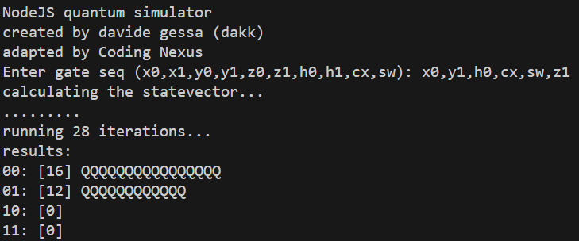

# Quantum Simulator for NodeJS

NodeJS-quantum-simulator is an experimental quantum computing simulator for the NodeJS.
This code was adapted from [dakk's qc64](https://github.com/dakk/qc64/)

## Features

-    Simulate operations of various quantum gates including Pauli-X, Pauli-Y, Pauli-Z, Hadamard, CNOT, and SWAP on a two-qubit system.

## How it works

Starting from the initial state |00>, the simulator can apply various quantum gates to manipulate the state of the two-qubit system. This allows for the simulation of various quantum computing concepts!

## Contributions

Contributions to NodeJS-quantum-simulator are welcome! Feel free to create a pull request or open an issue if you have ideas for improvements or spot any bugs.

## License

NodeJS-quantum-simulator is released under MIT License.
